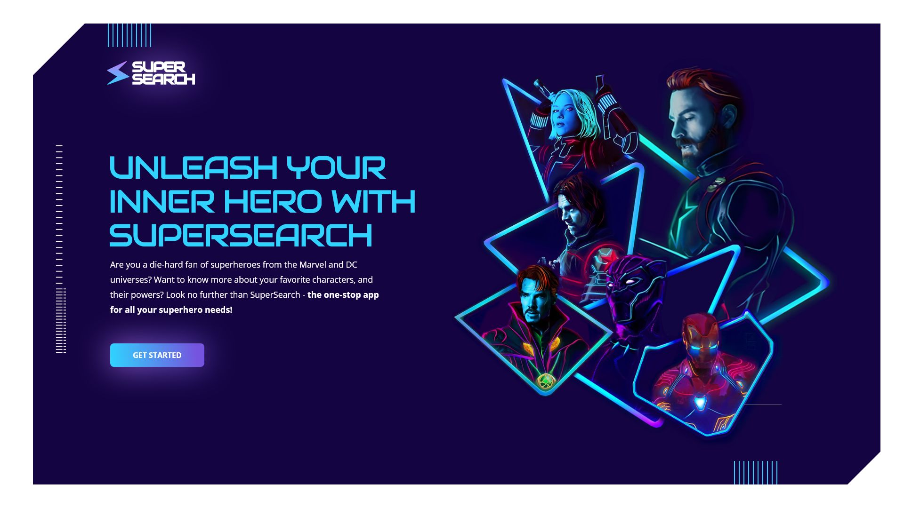

## Introduction
Welcome!

                                                      

This project is intended as a learning and development tool for HTML, CSS, JavaScript, and the React framework.

The Supersearch app is a powerful tool for Marvel/DC fans, allowing them to easily find and explore their favorite characters. Whether it's discovering new versions of beloved heroes or obtaining in-depth information about specific characters, this app provides a user-friendly and comprehensive search experience

## Get Started

## Build tool for this application
[Vitejs](https://vitejs.dev/guide/)

## Used dependencies
[Vite-plugin-svgr](https://www.npmjs.com/package/vite-plugin-svgr);
[Fontawesome](https://dev.to/davidemaye/how-to-set-up-font-awesome-in-react-5a8d);
[Axios](https://www.npmjs.com/package/axios);
[JWT-Decode](https://www.npmjs.com/package/jwt-decode);
[React Hook Form](https://www.npmjs.com/package/react-hook-form);
[React Router Dom](https://www.npmjs.com/package/react-router-dom);

## API - 2 REST APIs are used
* [Superhero API}(https://www.superheroapi.com/index.html)
ACCESTOKEN= 1289640744930206 or create your own (https://www.superheroapi.com/index.html)
* [superhero-api}(https://akabab.github.io/superhero-api/) This is a copy of the original, but cleaned up and modified to include a comprehensive overview of heroes.

## Novi Educational Backend
This server automatically becomes inactive if no requests are made for a while. Note!!!! The user database is often cleared within one hour.

## Starting the application
If you have cloned the project to your local machine, first install the node_modules by running the following command in the terminal:

`npm install`

Once this is done, you can start the application using:

`npm run dev`

Open http://localhost:5173 to view the page in the browser. 

## Creating a User
The user can create their own account. There is no email confirmation (This is for planned for later).
## User Login
Users can log in to access the application.
## Selecting a Hero
You can choose from 6 different heroes.
## Searching
From the homepage, you can search for heroes, filter them, and add them to your favorites.
## Updating Profile
From the menu, you can update your own information such as profile picture, email, and password.
## Logging Out
After logging out, you will be thanked for using this application. The data in Local Storage will be removed after 14 days.

Let get started!
